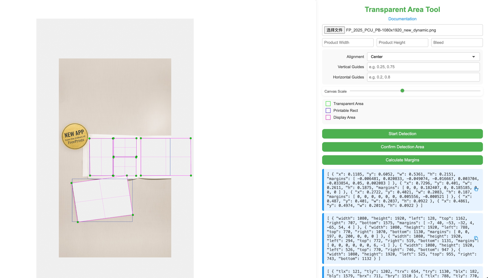

# PNG Transparent Area Measurement Tool

A web-based tool for measuring transparent areas in PNG images and calculating margins. This tool helps designers and developers accurately measure transparent areas and calculate proper margins for their designs.

## Features

- Upload PNG images with transparency
- Automatic detection of transparent areas
- Manual adjustment of detected areas
- Calculate aspect ratio based on product dimensions
- Support for bleed area calculations
- Interactive corner adjustment for precise margin calculations
- Real-time preview of measurements

## Usage

1. **Upload Image**
   - Click the file input button
   - Select a PNG image with transparency
   - The image will be displayed in the preview area

2. **Set Product Dimensions**
   - Enter the desired product width
   - Enter the desired product height
   - Enter the bleed value (if required)

3. **Detect Transparent Area**
   - Click the "Start Detection" button
   - The tool will automatically detect the transparent area
   - A green rectangle will show the detected area

4. **Adjust Detection (Optional)**
   - If the automatic detection needs adjustment, you can drag the edges of the green rectangle
   - Click and drag any edge to modify the detection area

5. **Confirm Detection**
   - Click the "Confirm Detection Area" button
   - The tool will calculate the proper aspect ratio and display a red rectangle

6. **Calculate Margins**
   - Click the "Calculate Margins" button
   - The tool will display two sets of information:
     - PO Info: Contains normalized coordinates (0-1) and margins
     - Template Info: Contains pixel-based coordinates and margins

## Output Format

### PO Info Format
```json
{
    "x": 0.1234,
    "y": 0.5678,
    "w": 0.4321,
    "h": 0.8765,
    "margins": [0.1, 0.2, 0.3, 0.4, 0.5, 0.6, 0.7, 0.8]
}
```

### Template Info Format
```json
{
    "width": 1000,
    "height": 800,
    "left": 123,
    "top": 456,
    "right": 789,
    "bottom": 1012,
    "margins": [10, 20, 30, 40, 50, 60, 70, 80]
}
```

### Samples



## Notes

- The tool works best with PNG images that have clear transparent areas
- For best results, ensure the transparent area has good contrast with the background
- The bleed value should be entered in the same unit as the product dimensions
- All measurements are calculated relative to the image dimensions
