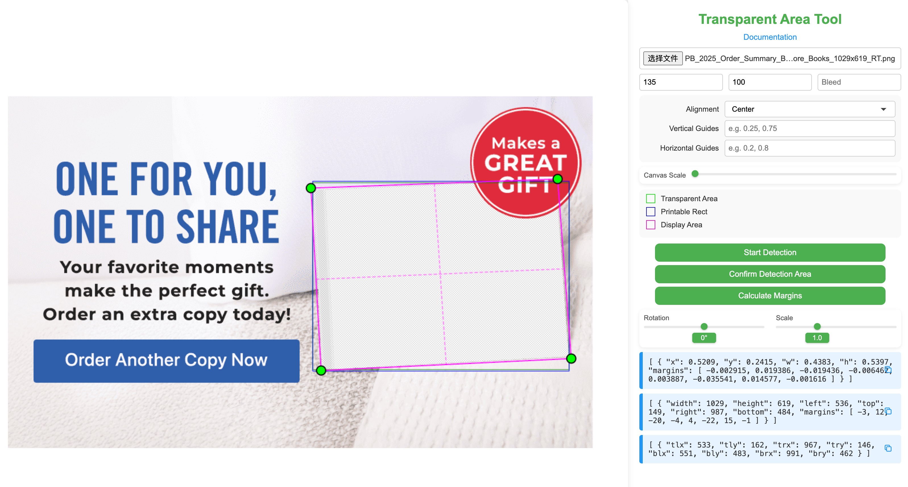

# PNG Transparent Area Measurement Tool

A web-based tool for measuring transparent areas in images, defining printable areas, and calculating custom margins. This tool helps designers and developers accurately set up print files.

## Features

- Upload PNG, JPEG, or WEBP images.
- Automatic detection of one or more transparent areas.
- Manual adjustment of detected transparent areas by dragging their edges.
- Define a printable area based on product aspect ratio and bleed values.
- Align the printable area (center, top, bottom, left, right).
- For single printable areas, apply rotation and scaling.
- Interactively adjust the final print area by dragging its corners to create custom margins.
- Add customizable vertical and horizontal guide lines for precise alignment.
- Zoom in and out of the canvas for a more detailed view.
- Real-time preview of all adjustments.
- Generate normalized (PO) and pixel-based (Template) coordinates.
- Calculate and display custom margins and final corner positions.

## Usage

1.  **Upload Image**
    - Click the file input button.
    - Select a PNG, JPEG, or WEBP image.
    - The image will be displayed in the preview area.

2.  **Set Parameters**
    - Enter `Product Width`, `Product Height`, and `Bleed`. These are used to calculate the aspect ratio of the printable area.
    - Select an `Alignment` for the printable area within the transparent area.
    - (Optional) Enter `Vertical Guides` and `Horizontal Guides` as comma-separated values between 0 and 1 (e.g., `0.25, 0.75`) to display guide lines. A center line is always shown.

3.  **Detect Transparent Area**
    - Click the "Start Detection" button.
    - The tool will automatically detect transparent area(s).
    - A green rectangle will show the detected area(s).

4.  **Adjust Detection (Optional)**
    - If the automatic detection needs adjustment, you can drag the edges of the green rectangle(s).
    - Click and drag any edge to modify a detection area.

5.  **Confirm Detection**
    - Click the "Confirm Detection Area" button.
    - This generates the printable area based on your parameters.
    - An interactive magenta shape with adjustable corners will appear.
    - If a single area was detected, `Rotation` and `Scale` controls will also become available.

6.  **Adjust Printable Area (Optional)**
    - Use the `Rotation` and `Scale` sliders to transform the printable area (single area only).
    - Drag the corners of the magenta shape to create custom margins. This works for single or multiple areas.

7.  **Calculate Margins**
    - Click the "Calculate Margins" button.
    - The tool calculates any custom margins you created by adjusting the corners.
    - The `PO Info` and `Template Info` panels will be updated to include a `margins` array if adjustments were made.
    - The `Positions Info` panel will appear, showing the final pixel coordinates of the four corners of the printable area(s).

## Output Format

### PO Info Format
The `margins` array is optional and appears only after adjustment and calculation. It contains 8 values representing the x and y offsets for the top-left, top-right, bottom-right, and bottom-left corners, normalized to the image dimensions.
```json
[
    {
        "x": 0.1234,
        "y": 0.5678,
        "w": 0.4321,
        "h": 0.8765,
        "margins": [0.01, 0.02, -0.01, 0.025, -0.015, -0.02, 0.01, -0.025]
    }
]
```

### Template Info Format
The `margins` array is optional and contains 8 values representing the pixel offsets for the four corners.
```json
[
    {
        "width": 1000,
        "height": 800,
        "left": 123,
        "top": 456,
        "right": 555,
        "bottom": 912,
        "margins": [10, 20, -10, 25, -15, -20, 10, -25]
    }
]
```

### Positions Info Format
This shows the final absolute pixel coordinates for each of the four corners of the printable area(s).
```json
[
    {
        "tlx": 133,
        "tly": 476,
        "trx": 545,
        "try": 481,
        "blx": 113,
        "bly": 892,
        "brx": 540,
        "bry": 887
    }
]
```

### Samples



## Notes

- For best results with automatic detection, use images with clear, high-contrast transparent areas.
- The bleed value should be entered in the same unit as the product dimensions.
- All measurements are calculated relative to the image dimensions.
